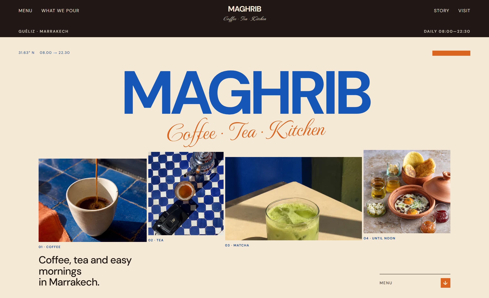
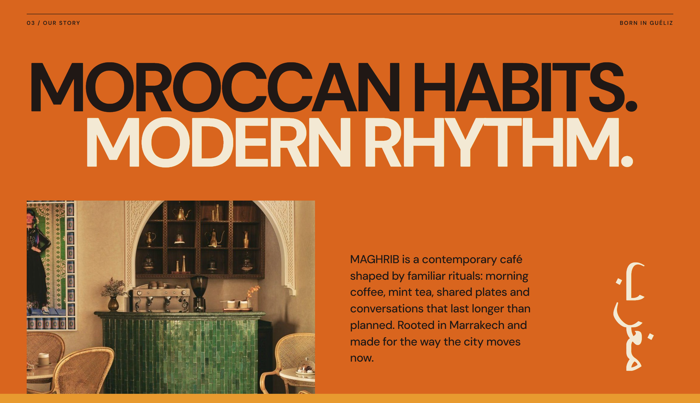
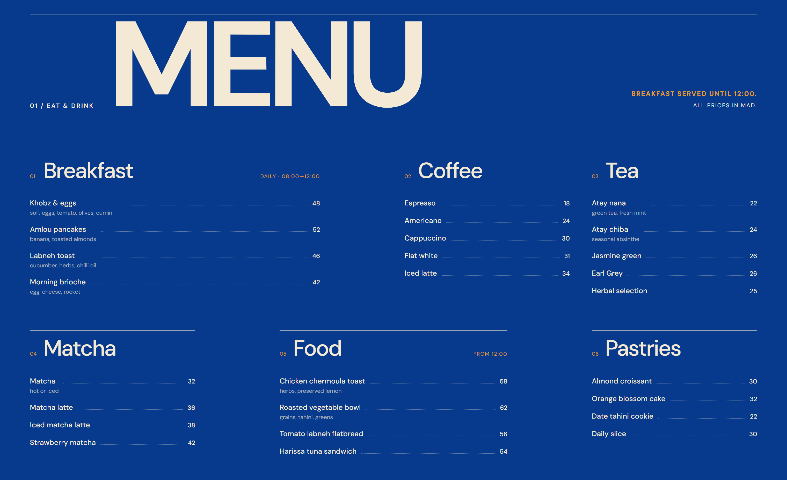

# MAGHRIB Café

A responsive, static presentation website for a fictional contemporary café in Marrakech.

> **Live Demo:** https://maghrib-cafe.vercel.app/

---

## Preview



<p align="center">
  
  
</p>

---

## Stack

- **Framework & Bundler:** React, Vite
- **Language & Styling:** JavaScript (ES6+), Custom CSS (Flexbox / CSS Grid)
- **Package Manager:** npm

*Note: This is a purely static frontend build—no external UI libraries, backend, API, or database layers are involved.*

---

## Project Structure

```text
maghrib-cafe/
├── public/
│   ├── images/
│   └── favicon.svg
├── src/
│   ├── components/
│   │   ├── Footer.jsx
│   │   ├── Gallery.jsx
│   │   ├── Header.jsx
│   │   ├── Hero.jsx
│   │   ├── Menu.jsx
│   │   ├── Story.jsx
│   │   ├── Visit.jsx
│   │   └── WhatWePour.jsx
│   ├── data/
│   │   └── menu.js
│   ├── App.jsx
│   ├── main.jsx
│   └── styles.css
├── .gitignore
├── index.html
├── package.json
├── package-lock.json
├── README.md
└── vite.config.js